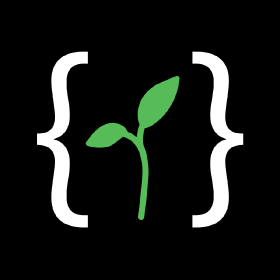

[![Contributors][contributors-shield]][contributors-url]
[![Forks][forks-shield]][forks-url]
[![Stargazers][stars-shield]][stars-url]
[![Issues][issues-shield]][issues-url]
[![MIT License][license-shield]][license-url]
[![LinkedIn][linkedin-shield]][linkedin-url]


<!-- PROJECT LOGO -->
<br />
<p align="center">
  <a href="https://github.com/lucasliano/auth-for-newbs">
    
  </a>

  <h3 align="center">FullStack Authenticator Template</h3>

  <p align="center">
    Little full stack web app used to show how to correctly manage an auth service
    <br />
    <a href="https://github.com/lucasliano/auth-for-newbs"><strong>Explore the docs »</strong></a>
    <br />
    <br />
    <a href="https://github.com/lucasliano/auth-for-newbs">View Demo</a>
    ·
    <a href="https://github.com/lucasliano/auth-for-newbs/issues">Report Bug</a>
    ·
    <a href="https://github.com/lucasliano/auth-for-newbs/issues">Request Feature</a>
  </p>
</p>


<!-- TABLE OF CONTENTS -->
<details open="open">
  <summary><h2 style="display: inline-block">Table of Contents</h2></summary>
  <ol>
    <li>
      <a href="#about-the-project">About The Project</a>
      <ul>
        <li><a href="#built-with">Built With</a></li>
      </ul>
    </li>
    <li>
      <a href="#getting-started">Getting Started</a>
      <ul>
        <li><a href="#prerequisites">Prerequisites</a></li>
        <li><a href="#installation">Installation</a></li>
      </ul>
    </li>
    <li><a href="#usage">Usage</a></li>
    <li><a href="#roadmap">Roadmap</a></li>
    <li><a href="#contributing">Contributing</a></li>
    <li><a href="#license">License</a></li>
    <li><a href="#contact">Contact</a></li>
    <li><a href="#acknowledgements">Acknowledgements</a></li>
  </ol>
</details>


<!-- ABOUT THE PROJECT -->
## About The Project

[![Product Name Screen Shot][product-screenshot]](https://github.com/lucasliano/auth-for-newbs)


### Built With

* [Node Js](https://nodejs.org/es/)
* [Vue.js](https://vuejs.org/)
* [MongoDB](https://www.mongodb.com/es)
* [Bootswatch](https://bootswatch.com/)
* [bcryptjs](https://www.npmjs.com/package/bcryptjs)
* [joi](https://www.npmjs.com/package/joi)


<!-- GETTING STARTED -->
## Getting Started

To get a local copy up and running follow these simple steps.


### Installation

1. Clone the repo
   ```sh
   git clone https://github.com/lucasliano/auth-for-newbs.git
   ```
2. Install NPM packages in the server and client dir
   ```sh
   npm install
   ```
3. You have to set up some .env files.


<!-- ROADMAP -->
## Roadmap

See the [open issues](https://github.com/lucasliano/auth-for-newbs/issues) for a list of proposed features (and known issues).


<!-- CONTRIBUTING -->
## Contributing

Contributions are what make the open source community such an amazing place to be learn, inspire, and create. Any contributions you make are **greatly appreciated**.

1. Fork the Project
2. Create your Feature Branch (`git checkout -b feature/AmazingFeature`)
3. Commit your Changes (`git commit -m 'Add some AmazingFeature'`)
4. Push to the Branch (`git push origin feature/AmazingFeature`)
5. Open a Pull Request


<!-- LICENSE -->
## License

Distributed under the MIT License. See `LICENSE` for more information.


<!-- CONTACT -->
## Contact

Lucas Liaño - lliano@frba.utn.edu.ar

Project Link: [https://github.com/lucasliano/auth-for-newbs](https://github.com/lucasliano/auth-for-newbs)


<!-- ACKNOWLEDGEMENTS -->
## Acknowledgements

* [CodingGarden repo](https://github.com/CodingGarden/auth-for-newbs)
* [README Template](https://github.com/othneildrew/Best-README-Template)


<!-- MARKDOWN LINKS & IMAGES -->
<!-- https://www.markdownguide.org/basic-syntax/#reference-style-links -->
[contributors-shield]: https://img.shields.io/github/contributors/lucasliano/repo.svg?style=for-the-badge
[contributors-url]: https://github.com/CodingGarden/auth-for-newbs/graphs/contributors
[forks-shield]: https://img.shields.io/github/forks/lucasliano/repo.svg?style=for-the-badge
[forks-url]: https://github.com/CodingGarden/auth-for-newbs/network/members
[stars-shield]: https://img.shields.io/github/stars/lucasliano/repo.svg?style=for-the-badge
[stars-url]: https://github.com/CodingGarden/auth-for-newbs/stargazers
[issues-shield]: https://img.shields.io/github/issues/lucasliano/repo.svg?style=for-the-badge
[issues-url]: https://github.com/CodingGarden/auth-for-newbs/issues
[license-shield]: https://img.shields.io/github/license/lucasliano/repo.svg?style=for-the-badge
[license-url]: https://github.com/CodingGarden/auth-for-newbs/blob/master/LICENSE.txt
[linkedin-shield]: https://img.shields.io/badge/-LinkedIn-black.svg?style=for-the-badge&logo=linkedin&colorB=555
[linkedin-url]: https://linkedin.com/in/lucas-liaño-086b1514a
[product-screenshot]: images/screenshot.png
